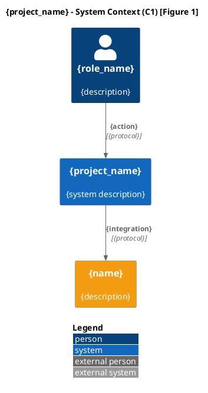
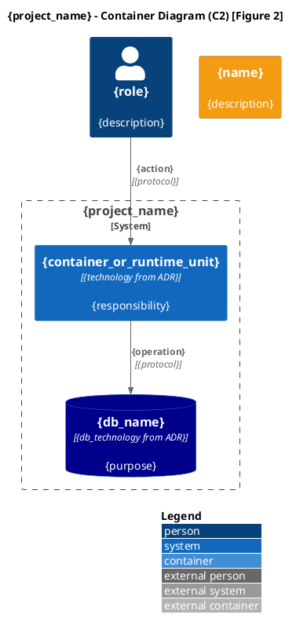
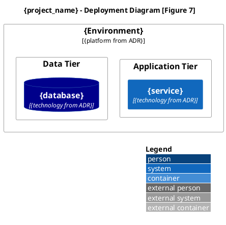
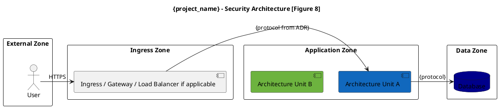

# Establishing Architecture Foundation — Agent-Native Spec

## Quick Start
Build the target architecture foundation from domain boundaries, ADRs, and PRD.
Output is a **manifest + per-service files**. No prose. No executive narratives.
Only structured data the downstream agents (specifying-architecture,
defining-qe-strategy, generating-test-cases) need.

## Output Architecture

```
{target_architecture_path}/
├── ARCH-FOUNDATION-SPEC-{SESSION_ID}.md   ← Manifest: principles, C4 diagrams (PlantUML),
│                                             service catalog index, deployment map,
│                                             security map, traceability, validations,
│                                             open_questions
├── services/                               ← Per-service files (one per service)
│   ├── svc-01-{name}.md
│   ├── svc-02-{name}.md
│   └── ...
└── ARCH-FOUNDATION-AUDIT-{SESSION_ID}.md  ← Session metadata + audit trail
```

**Why manifest + per-service files + per-diagram chunking (Pattern 2, chunked):**
The manifest is generated in four phases, each independently retryable via checkpoint:
  - Phase A — skeleton: principles, quality attributes, catalog index, dependency
    matrix. One LLM call, ~200 K input tokens.
  - Phase B — per-service files (Step 4): one LLM call per service,
    ~300-500 K tokens each, Write-Flush-Forget.
  - Phase C — per-diagram PlantUML blocks: one LLM call per diagram (8 total),
    ~300 K tokens each, appended to manifest.
  - Phase D — tail sections (security_controls, traceability_audit,
    engineering_assumptions, open_questions): FOUR Edit calls, one per section,
    in the order listed. Validation gate runs after all four are written.
No single LLM call exceeds ~800 K tokens or ~8 minutes — 504 risk vanishes.
Cache hit rate rises because PRD + ADR + domain-boundaries context is cached
across the small calls.

**Human-readable output:** Not produced by this skill. Use `humanize-spec` skill
with the `arch-foundation` rendering profile to generate rich architecture documents
(executive summaries, principle narratives, diagram annotations, meeting agendas)
from this spec on demand.

## Parameters
| Name | Type | Required | Description |
|------|------|----------|-------------|
| domain_boundaries_path | string | Yes | Path to domain boundary analysis (or folder) |
| adrs_path | string | Yes | Path to ADR collection (folder or summary) |
| prd_path | string | Yes | Path to PRD document |
| project_name | string | Yes | Project identifier |
| epics_path | string | No | Path to epics document |
| tech_stack_path | string | No | Path to tech stack evaluation |
| current_architecture_path | string | No | Path to current architecture |
| target_architecture_path | string | Yes | Output path |
| chunk_size | integer | No | Max C4 diagrams to generate per invocation in Phase C. Default: 8 (all). Set to 2-3 when model output budget is constrained. |
| resume_from_phase | string | No | Resume from phase: "A" (skeleton), "B" (services), "C-{diagram_id}" (e.g., "C-c3_component_a"), "D" (tail). Default: start from beginning. |
| failure_feedback | string | No | Feedback for REPAIR mode |

**If any Required parameter is not defined, ABORT EXECUTION.**

## Workflow

### Step 1: Initialize

**Command:**
```
# Target Architecture Foundation Architect — Agent-Native Spec Generator
# Persona: Senior Software Architect — C4 modeling, DDD decomposition, microservices.
#   Formal third person. Minimal verbosity. No jargon.
# CRITICAL: NON-INTERACTIVE SESSION. PROCEED AUTONOMOUSLY.
# MISSION: Synthesize structured architecture foundation from upstream artifacts.
#   Zero invention. Agent-consumable output.

IF failure_feedback NOT empty:
  MODE = REPAIR
  SPEC_FOLDER = resolve_parent_folder(target_architecture_path)
  SPEC_FILE = find existing ARCH-FOUNDATION-SPEC-*.md in SPEC_FOLDER
  IF not found → write Gap Report → EXIT
  Load SPEC_FILE → PREVIOUS_SPEC → SOURCE_LOG
  SERVICES_SUBFOLDER = SPEC_FOLDER + 'services/'
  Load existing service files → SERVICE_INVENTORY
  PREVIOUS_VERSION = extract version
  NEW_VERSION = increment patch
  Parse failure_feedback → REPAIR_DIRECTIVES [{ target: "manifest_section"|"SVC-XX"|"global", instruction, reason }]
ELSE:
  MODE = BUILD
  SPEC_FOLDER = target_architecture_path + '/'
  ## SESSION_ID goes in spec FILENAMES only — never in the folder name.
  ## The folder must match the capability YAML path parameter exactly.
  SPEC_FILE = SPEC_FOLDER + 'ARCH-FOUNDATION-SPEC-' + SESSION_ID + '.md'
  AUDIT_FILE = SPEC_FOLDER + 'ARCH-FOUNDATION-AUDIT-' + SESSION_ID + '.md'
  SERVICES_SUBFOLDER = SPEC_FOLDER + 'services/'
  CHECKPOINT_FILE = SERVICES_SUBFOLDER + '_checkpoint.json'
  NEW_VERSION = "1.0.0"
  mkdir -p SPEC_FOLDER
  mkdir -p SERVICES_SUBFOLDER

  ## SESSION_ID is provided by the harness/execution metadata per execution-protocol.md §1.
  ## REPAIR mode MUST reuse the existing session_id from prior ARCH-FOUNDATION-* filenames.
  ## SESSION_ID goes in filenames only (e.g. ARCH-FOUNDATION-SPEC-{SESSION_ID}.md), never in folder names.

  **FIRST ACTION — MANDATORY:** Write `_progress.json` to the output folder before any other file write.
  This prevents the orchestrator from sending SIGINT.
  WRITE SPEC_FOLDER + '/_progress.json':
    { "skill": "establishing-architecture-foundation", "session_id": "initializing",
      "status": "RUNNING", "started_at": "<ISO timestamp>", "completed_at": null,
      "total": 0, "completed": 0, "items": [] }

  ## Resume from checkpoint (if interrupted mid-service-generation)
  IF CHECKPOINT_FILE exists:
    Load CHECKPOINT_FILE → FOUNDATION_INDEX (includes service_files, generation_progress,
      tech_decisions, services, bounded_contexts, fidelity_corrections)
    LOG: "RESUME: loaded checkpoint. Services completed: {generation_progress.services_completed}/{generation_progress.services_total}."
    # The Write-Flush-Forget loop in Step 4 will skip already-completed services.

SOURCE_LOG = []
CHANGE_LOG = []
PROCESS_LOG = []

## Zero Invention Policy
Not in source → status: pending. Never infer, assume, or create information.
Inferred industry standards → status: assumption (with ASM-XX ID).

## FIC Principles
1. Foundational: Zero Invention. ADR Technology Fidelity: versions MUST match ADR decisions.
2. Instructional: Per-service files use Write-Flush-Forget. Manifest written as single file after all services complete.
3. Contextual: Carry forward ONLY FOUNDATION_INDEX metadata, NOT full service file text.

## Global Conventions
- PlantUML Colors: Core=#1168bd, Supporting=#6db33f, Generic=#999999,
  External=#f39c12, DB=#darkblue
- PlantUML Strict Rules (ALL diagram sections):
  1. Use ONLY macro signatures shown in reference templates. Do NOT add $tags, $sprite, $link, or any keyword parameter not in the template.
  2. Container_Boundary() for nesting Components. NEVER use Container() with curly braces.
  3. ContainerDb() is ONLY for databases/data stores. For external services use System_Ext().
  4. Every alias in Rel() MUST be declared earlier in the same diagram. No undefined aliases.
  5. Every macro call MUST have matching parentheses: Container(id, "Name", "Tech", "Desc").
  6. Sequence diagrams: PLAIN PlantUML only. No C4 !include. No C4 macros. Use: actor, participant, database, queue.
  7. Security diagram: PLAIN PlantUML only. No C4 !include. Use rectangle for zones.
  8. Every message label in sequence diagrams MUST be on a SINGLE file line. Use \n for visual line breaks within the label.
  9. Only valid escape in labels is \n. Do NOT generate \M, \U, \C, \. or any other backslash-letter combo.
- Horizontal Slicing: [SVC-ID]-BE / [SVC-ID]-FE. No hybrids.
- Gherkin: Happy + Unhappy per service in per-service files.
- Style: Formal third person. Minimal verbosity. Zero prose.
- Max 3000 tokens per service file. If larger, split.

## PATH GUARD — MANDATORY
target_architecture_path is the FINAL folder path as resolved by the capability.
Use it EXACTLY as provided — do NOT prepend artifacts/outputs/ or any other prefix.
Do NOT infer a parent folder from sibling parameters (e.g. adrs_path, domain_boundaries_path, prd_path).
  Wrong: artifacts/outputs/product-delivery/ + target-architecture
         (stealing prefix from a sibling's path)
  Right: target-architecture (use the parameter value directly, relative to execution_dir)
If target_architecture_path is a bare segment (no `/` or `./`), treat it as relative to CWD.
If a sibling parameter has a full path and yours is bare, that is an UPSTREAM BUG —
abort with a Gap Report instead of adopting the sibling's parent.

## EARLY-WRITE RULE — MANDATORY
Silent-failure prevention. You MUST write the FIRST per-service file (first service in
FOUNDATION_INDEX.services) within 5 tool calls after entering Step 4. "Read more, think
more" before the first service-file write is the #1 silent-failure pattern — multi-minute
thinking loops that never produce output. If you cannot produce the first service file
after 5 reads, ABORT with a Gap Report identifying which inputs were missing. Each
subsequent service + each Phase C diagram uses Write-Flush-Forget (one tool call each),
NOT a single final dump.

## Internal Reasoning: ALL in English regardless of output language.
```
**Execution:** automated


### Step 2: Input Validation (STOP-GATE)

**Command:**
```
## Critical Gate
READ domain_boundaries FROM domain_boundaries_path
IF missing or empty → write Gap Report to AUDIT_FILE → EXIT.

READ adrs FROM adrs_path
IF missing AND no tech decisions available → write Gap Report to AUDIT_FILE → EXIT.

READ prd FROM prd_path
IF missing → log "Deriving NFR defaults", continue.

## Extract Upstream Data
FROM domain_boundaries EXTRACT:
  ARCH_CONTEXT = {
    bounded_contexts: [BC-XX with names, subdomains, capabilities],
    services: [SVC-XX with slices, contexts],
    context_relationships: [relationship pairs],
    integration_patterns: [patterns],
    event_flows: [flows],
    nfrs_by_context: {BC-XX → targets}
  }

FROM adrs EXTRACT:
  TECH_DECISIONS = {
    "ADR-001": { technology: "...", version: "...", layer: "..." },
    "ADR-005": { technology: "...", version: "...", layer: "Data" },
    ...
  }
  ADR_PRINCIPLES = [principle summaries from ADR decisions]

FROM prd EXTRACT:
  ARCH_CONTEXT += {
    prd_nfr_ids: {NFR-XX → description, target},
    prd_risks: [RSK-XX entries],
    prd_assumptions: [ASM-XX entries],
    user_roles: [actors from PRD personas],
    prd_traceability_gaps: [gap items]
  }

FROM epics (if available) EXTRACT:
  ARCH_CONTEXT += {
    epic_priorities: [EPIC-XX with tiers],
    epic_dependencies: [dependency pairs]
  }

FROM tech_stack_path (if available) EXTRACT:
  Merge tech stack evaluation data into TECH_DECISIONS (ADR takes precedence on conflicts).

FROM current_architecture_path (if available) EXTRACT:
  ARCH_CONTEXT += {
    existing_services: [current service inventory],
    migration_constraints: [constraints for brownfield]
  }

Detect language → DETECTED_LANGUAGE

## Initialize FOUNDATION_INDEX
FOUNDATION_INDEX = {
  tech_decisions: TECH_DECISIONS,
  services: ARCH_CONTEXT.services,
  bounded_contexts: ARCH_CONTEXT.bounded_contexts,
  service_files: {},          # {SVC-XX → filename, metadata}
  diagrams: [],               # [{id, type, section, validated}]
  fidelity_corrections: [],   # tech corrections logged
  prd_risks_mapped: [],       # RSK-XX → section mapping
  assumptions_mapped: [],     # ASM-XX → section mapping
  generation_progress: {
    services_completed: 0,
    services_total: len(ARCH_CONTEXT.services),
    manifest_written: false,
    audit_written: false
  }
}
```
**Execution:** automated

### Step 3: Upstream Consistency Rules

**Loaded once. Apply during ALL generation steps.**

```
## UPSTREAM CONSISTENCY RULES (Mandatory)

# 1. ADR Technology Fidelity (CRITICAL)
Every technology name and version MUST exactly match the ADR decision.
Before writing ANY tech reference, verify against FOUNDATION_INDEX.tech_decisions.
Writing "Java 17+" when ADR-001 says "Java 1.8" = FIDELITY VIOLATION. Correct and log.

# 2. Technology Neutrality (Scoped)
Tech names ONLY in sections whose topic IS that decision.
Service catalog data ownership: "embedded relational database" not "H2"
(unless citing ADR-005). Diagram ContainerDb labels MAY name tech per ADR decision.
Prose descriptions prefer capability language.

# 3. PRD Risk Carry-Forward (Mandatory)
RSK-XX from ARCH_CONTEXT.prd_risks MUST be referenced in the manifest
(tech_stack_overview risks AND traceability_audit).

# 4. PRD Assumption Carry-Forward (Mandatory)
ASM-XX from ARCH_CONTEXT.prd_assumptions MUST be referenced where they
affect NFR targets in per-service files.

# 5. Epic Alignment
Phased implementation in manifest MUST reference EPIC-XX IDs.
Must Have → Phase 1. Should Have → Phase 2. Could Have → Phase 3.

# 6. Architecture Unit Coverage
When FOUNDATION_INDEX.services identifies service boundaries, those services MUST appear in per-service files
and in the architecture views where those service boundaries are represented.
When the architecture uses non-service runtime or module boundaries, those architecture units
MUST appear in the applicable architecture views.

# 7. Source Fidelity Check (per section, before writing)
  a. Tech names: only if section's topic covers that tech
  b. Service refs: all SVC-XX exist in FOUNDATION_INDEX.services
  c. ADR refs: all ADR-NNN exist in FOUNDATION_INDEX.tech_decisions
  d. Versions: match FOUNDATION_INDEX.tech_decisions exactly
  IF violations → correct before writing. Log corrections in CHANGE_LOG.
```
**Execution:** automated

### Step 4: Generate Per-Service Files

Read `references/unit-03-service-catalog.md` for per-service structure.

Execute this step only when FOUNDATION_INDEX.services identifies distinct service boundaries.
Per-service files are generated BEFORE the manifest because the manifest's
service_catalog_index references service file metadata.

**Mode-Specific Behavior:**
- **REPAIR:** If REPAIR_DIRECTIVES target specific SVC-XX, regenerate only those
  service files. Preserve untargeted files verbatim.
- **BUILD:** Generate all from scratch.

**Pattern Reuse Search (MANDATORY before declaring a NEW service):**

Before adding a NEW service to FOUNDATION_INDEX.services, the agent MUST search the context-pack for an existing pattern (runtime, deployment surface, scheduler, gateway, sync job, …) that solves the same problem. Inventing a new service when one is documented in the context-pack is a protocol violation.

```
CP_FILES = <context-pack files surfaced in the system prompt at
            session start (loaded by the harness)>

FOR EACH candidate in FOUNDATION_INDEX.services:
  search_terms = derive_search_terms(candidate)   # nouns + stems from name/responsibilities
  matched = false
  FOR EACH file in CP_FILES:
    IF exists(file):
      hits = grep_case_insensitive(file, search_terms)
      IF hits:
        candidate.pattern_source = file + "#" + hits[0].line
        candidate.classification = "reuse"
        record_in_audit:
          "Pattern reuse: service '" + candidate.name + "' grounded in " + file
        matched = true; break
  IF NOT matched:
    candidate.classification = "new"
    record_in_audit:
      "Pattern reuse search: no existing pattern for service '" +
      candidate.name + "'. Searched " + len(CP_FILES) + " context-pack files."

## Reuse-classified services MUST use the pattern_source verbatim in
## service_card, dependency_map, and Gherkin scenarios.
```

**Write-Flush-Forget Protocol (per service):**

```
REMAINING_SERVICES = list of FOUNDATION_INDEX.services (ordered by subdomain: Core first)
COMPLETED_SERVICES = []

IF len(REMAINING_SERVICES) == 0:
  LOG "No distinct service boundaries identified. Skip per-service file generation."
ELSE:
  WHILE REMAINING_SERVICES is not empty:

  SVC-XX = REMAINING_SERVICES.pop_first()

  IF REPAIR and no directive targets this SVC → SKIP. CONTINUE.
  IF FOUNDATION_INDEX.service_files[SVC-XX] exists (already completed from checkpoint) → SKIP. CONTINUE.

  #================================================================
  # PHASE 1: LOAD SERVICE SOURCE DATA
  #================================================================

  1. LOAD from FOUNDATION_INDEX.services[SVC-XX]: name, slice, context, subdomain
  2. LOAD bounded context details from FOUNDATION_INDEX.bounded_contexts
  3. LOAD tech decisions that apply to this service from FOUNDATION_INDEX.tech_decisions
  4. LOAD NFR targets from ARCH_CONTEXT.prd_nfr_ids for this service's context
  5. LOAD dependencies from ARCH_CONTEXT.context_relationships

  ## ZERO INVENTION CHECKPOINT:
  Service responsibilities, API contracts, and data ownership MUST derive from the
  domain boundary analysis. Gherkin scenarios MUST derive from PRD FRs or business rules.

  #================================================================
  # PHASE 2: GENERATE service specification
  #================================================================

  ### Per-Service File Structure

  # {project_name} — SVC-{NN}: {Service Name}

  ## service_card
  | Attribute | Value |
  | service_id | {SVC-XX}-BE / {SVC-XX}-FE |
  | bounded_context | {BC-XX}: {name} |
  | subdomain_type | Core / Supporting / Generic |
  | responsibility | {from domain boundaries} |
  | api_contract | {endpoints, methods, content types} |
  | data_ownership | {entities owned — capability language unless citing data ADR} |
  | dependencies | [{other services with relationship type}] |
  | technology_stack | {MUST match FOUNDATION_INDEX.tech_decisions — verify each entry} |
  | nfr_targets | {from prd_nfr_ids, note ASM-XX if derived from assumption} |
  | team_ownership | {suggested team or TBD} |

  ## horizontal_slicing
  - [{SVC-XX}-BE]: Domain logic, business rules, data persistence, integrations
  - [{SVC-XX}-FE]: Presentation, user interaction, client-side validation (if user-facing)
  No hybrid services.

  ## gherkin_scenarios

  ### happy_path
  ```gherkin
  Scenario: {service_name} successful operation
    Given {precondition from FR/business rule}
    When {action}
    Then {expected outcome}
  ```

  ### unhappy_path
  ```gherkin
  Scenario: {service_name} error handling
    Given {precondition}
    When {invalid action or failure condition}
    Then {error handling behavior}
    And {system remains consistent}
  ```

  ## dependency_map
  | depends_on | relationship_type | protocol | data_exchanged |

  #================================================================
  # PHASE 3: FIDELITY CHECK → WRITE → FLUSH
  #================================================================

  ## Source Fidelity Check
  - Tech stack entries match FOUNDATION_INDEX.tech_decisions exactly
  - Service ID exists in FOUNDATION_INDEX.services
  - NFR targets use PRD NFR-XX format
  - Gherkin traces to PRD FRs or domain boundary business rules
  IF violations → correct. Log to FOUNDATION_INDEX.fidelity_corrections.

  ## WRITE FILE NOW
  Save to SERVICES_SUBFOLDER/svc-{NN}-{name-slug}.md. Mandatory tool call.

  ## UPDATE FOUNDATION_INDEX
  FOUNDATION_INDEX.service_files[SVC-XX] = {
    file: "svc-{NN}-{name-slug}.md",
    subdomain: "...",
    slice: "BE/FE",
    tech_verified: true/false,
    gherkin_count: 2,
    dependencies: [...]
  }
  FOUNDATION_INDEX.generation_progress.services_completed += 1

  ## WRITE CHECKPOINT: Serialize FOUNDATION_INDEX to CHECKPOINT_FILE (_checkpoint.json).
  ## This enables resumption if interrupted mid-service-generation.
  ## Checkpoint contains: tech_decisions, services, bounded_contexts, service_files,
  ## fidelity_corrections, generation_progress (services_completed, services_total).

  ## FLUSH service text. Only FOUNDATION_INDEX survives.
  ## VERIFY file exists and is non-empty.
  ## LOG: "SVC-XX complete. Progress: {completed}/{total}."

  Add SVC-XX to COMPLETED_SERVICES. CONTINUE.
```

**Post-Service-Generation Verification:**
1. When services are identified, all service files exist. Count == FOUNDATION_INDEX.services count.
2. Summary count verification: service file count == stated total.
3. LOG: "All {N} service files generated." or "No service files required for this architecture."

**Execution:** automated

### Step 5: Generate ARCH-FOUNDATION-SPEC Manifest (Phased, Write-Flush-Forget)

Read reference files for section-specific templates:
- `references/units-01-02-summary-principles.md` — principles structure
- `references/units-04-07-context-container-component.md` — C4 Context/Container/Component templates
- `references/units-08-11-sequence-deploy-security.md` — Sequence/Deployment/Security templates
- `references/units-12-13-traceability-governance.md` — traceability audit structure

**Phase plan — each phase is a SEPARATE tool call and independently retryable via checkpoint:**

- **Phase A — Manifest skeleton (single LLM call, ~200 K tokens in):**
  Write SPEC_FILE with the header + `tech_stack_overview` + `phased_implementation` +
  `key_risks` + `architecture_principles` + `quality_attribute_priorities` +
  `service_catalog_index` + `service_dependency_matrix` when services are identified — **no diagrams yet**.
  Header includes `status: IN_PROGRESS_PHASE_A_COMPLETE`.
  Update `FOUNDATION_INDEX.generation_progress.manifest_skeleton_written = true`.
  Write checkpoint. Flush.

- **Phase B — Per-service loop (already executed in Step 4).**
  If `resume_from_phase = "B"`, re-enter the Step 4 loop from the first missing service.

- **Phase C — Per-diagram loop (NEW — ONE LLM call per diagram, architecture-fit set, ~300 K tokens each):**
  For each applicable diagram in order
  (`c1_system_context`, `c2_container`, `c3_component_a`, `c3_component_b`,
  `sequence_flow_1`, `sequence_flow_2`, `deployment`, `security`):
  1. Load ONLY the reference file for THIS diagram's group (not all four at once).
  2. Generate the PlantUML block.
  3. Run the Diagram Validation checklist (below).
  4. APPEND `### {diagram_id}\n<plantuml block>\n` to SPEC_FILE. Mandatory tool call.
  5. Update `FOUNDATION_INDEX.diagrams += [{id, type, validated: true}]`.
  6. Update `_progress.json` → `completed += 1`, `phase = "C-{diagram_id}"`.
  7. Write checkpoint. Flush the diagram from memory.
  If `chunk_size < 8`, stop after that many diagrams; the next invocation picks up
  at `resume_from_phase = "C-{next_diagram_id}"`.

- **Phase D — Tail sections (FOUR Edit calls, one per section, in order):**
  Populate each pending tail section as its OWN `Edit` call against the SPEC
  file, in this exact order:
  1. `security_controls`
  2. `traceability_audit`
  3. `engineering_assumptions`
  4. `open_questions`

  After each section's Edit completes, flush that section's content from memory
  and update `_progress.json` (`sections.{name}: complete`) before generating
  the next.

  **DO NOT** combine multiple tail sections into one `Edit` call. The combined
  `new_string` payload has been observed (2026-05-20) to exceed the runtime's
  per-call parameter budget; the runtime drops the `new_string` field silently,
  the call fails, and the recovery cascade (Bash + python3 heredoc rewrite of
  the spec file) destroys the artifact's atomic-write semantics. See
  execution-protocol.md §10.4 and §10.5.

  **If an `Edit` fails** for a single tail section — fix the `Edit` call (provide
  more surrounding context to make `old_string` unique; or apply the §10.5.1
  non-ASCII full-file `Write` fallback if the output language is not English).
  **NEVER** fall back to `Bash + sed/awk/python3 <<EOF/cat >` to mutate the
  SPEC file. That path is explicitly banned by §10.5.

  After all four tail sections are populated and checkpointed: run the Quality
  Validation Gate, then flip header `status` to `COMPLETE`.

**Chunk / resume protocol:**
- `resume_from_phase = null` → start at Phase A.
- `resume_from_phase = "A"` → regenerate skeleton (REPAIR).
- `resume_from_phase = "B"` → pick up service loop from first missing service.
- `resume_from_phase = "C-{diagram_id}"` → start Phase C at that diagram.
- `resume_from_phase = "D"` → run tail only.

**ANTI-BATCHING RULE — CRITICAL (applies to Phases B, C, AND D):**
Write ONE file (or ONE diagram / ONE section append) per tool call. Never batch
multiple services (Phase B), multiple diagrams (Phase C), OR multiple tail
sections (Phase D) into a single `Edit` call, a single `Write` payload, or a
single `bash` heredoc. Batching exhausts the runtime's per-call parameter
budget AND blows the context window before completion writes (LAST ACTION,
Memory Bank, stepwise outputs) can land.

Each service in Phase B = its own tool call.
Each diagram in Phase C = its own tool call.
Each tail section in Phase D = its own tool call (FOUR total).
Each phase = its own invocation if `chunk_size` is reached.

**Bulk-rewrite fallback is banned.** If a targeted `Edit` fails, fix the `Edit`
call — never reach for `Bash + sed/awk/python3 <<EOF/cat >` to mutate the SPEC
file. That escape hatch has been observed (2026-05-20) to cascade: agent hits
one snag, falls back to bulk rewrite, runtime drops further parameters, the
session ends with a partially corrupted spec. See execution-protocol.md §10.5.

**Non-ASCII output language (§10.5.1 fallback):** If the detected output
`language` is not English, OR any input source / `_extractions/*.md` contains a
codepoint > 127, use the full-file `Write` operation instead of `Edit` for
every section write in this run. Per-section discipline is unchanged (still
one section per call); only the tool changes. The targeted-edit runtime bug
observed 2026-05-19 can destroy non-English target files on UTF-8 failures,
so the full-file `Write` fallback is the safer path until the runtime is
fixed.

**Context Budget Rule:**
When reading upstream artifacts (ADRs, domain boundaries, architecture), read ONLY
manifest/index files (ADR-SPEC-*.md, BOUNDARIES-SPEC-*.md). Do NOT open individual
per-item files (adrs/adr-001-*.md, contexts/bc-01-*.md). The catalog tables in the
manifest contain all traceability data needed.

**IF MODE == REPAIR:**
  Load existing manifest. Apply REPAIR_DIRECTIVES to targeted sections only.
  Preserve untargeted sections verbatim. Re-run traceability_audit after any
  section repair. Increment version (patch).

**Manifest Section Generation Order (data flows forward):**

```
## Manifest Structure: ARCH-FOUNDATION-SPEC-{SESSION_ID}.md

# {project_name} — Architecture Foundation Spec
version: {NEW_VERSION}
session_id: {SESSION_ID}
mode: {MODE}
language: {DETECTED_LANGUAGE}

## tech_stack_overview
| layer | technology | version | adr_reference |
MUST match FOUNDATION_INDEX.tech_decisions exactly.
Source Fidelity: verify every row against tech_decisions before writing.

## phased_implementation
| phase | epics | architecture_units | objective |
Must Have epics → Phase 1. Should Have → Phase 2. Could Have → Phase 3.
Source: ARCH_CONTEXT.epic_priorities.

## key_risks
| risk_id | description | architecture_impact | source |
RSK-XX from ARCH_CONTEXT.prd_risks. Architecture-level implications.

## architecture_principles
| # | principle_name | description | adr_reference |
Derived from ADR decision rationale. Each ADR's "why" becomes a principle.
Example: ADR-004 rationale "simplicity for small team" → Principle: "Simplicity Over Sophistication."

## quality_attribute_priorities
| attribute | target | rationale | source |
Performance, Scalability, Availability, Security, Maintainability, Operability.
Targets from ARCH_CONTEXT.prd_nfr_ids. Derived from assumption → note ASM-XX.

## service_catalog_index
| svc_id | name | subdomain | bounded_context | file | tech_verified | gherkin_count |
Include when FOUNDATION_INDEX.service_files exists for identified service boundaries.
Built from FOUNDATION_INDEX.service_files metadata collected during Step 4.

## service_dependency_matrix
| service | depends_on | type | protocol |
Include when the architecture uses explicit service dependencies.
Source: ARCH_CONTEXT.context_relationships mapped to services.

## c4_diagrams

### c1_system_context

Actors from ARCH_CONTEXT.user_roles. External systems from domain boundaries.
Represent the system boundary, actors, and external systems supported by upstream artifacts.
Include service-level detail only when that boundary is represented in this view.

### c2_container

ADR Technology Fidelity: Container technology labels MUST match FOUNDATION_INDEX.tech_decisions.
ContainerDb used ONLY for actual databases/stores, NOT for external APIs.

### c3_component_a
Select the highest-priority service or architecture unit that warrants component-level detail from FOUNDATION_INDEX.services or the architecture foundation model.
```plantuml
@startuml
!include <C4/C4_Component>
skinparam backgroundColor white
LAYOUT_WITH_LEGEND()
title {Service A} - Component Diagram (C3) [Figure 3]

Container_Boundary(svc, "{Service A}") {
  Component(ctrl, "Controller", "REST Controller", "API entry point")
  Component(valid, "Validator", "Domain Service", "Input validation")
  Component(svc_domain, "Domain Service", "Service", "Business logic") #1168bd
  Component(repo, "Repository", "Data Access", "Persistence") #6db33f
  Component(evt, "Event Publisher", "Domain Events", "Notifications") #f39c12
}
Include only the components that exist for the selected service or architecture unit.

Rel(ctrl, valid, "validates")
Rel(valid, svc_domain, "delegates")
Rel(svc_domain, repo, "persists")
Rel(svc_domain, evt, "publishes")
Include event publisher and publish relationships only when the selected service emits domain events.
@enduml
```
Components nested inside Container_Boundary(), NOT inside Container().

### c3_component_b
Second-priority Core or Supporting service or another architecture unit needing component-level detail.
Same structure as c3_component_a when applicable. [Figure 4].

### sequence_flow_1
Most critical business flow (primary user action exercising core domain service).
```plantuml
@startuml
skinparam backgroundColor white
title {Flow Name} - Sequence Diagram [Figure 5]

actor "{Actor}" as user
participant "{Entry Point}" as entry
participant "{Application Logic}" as app
participant "{Persistence}" as store
participant "{Async Channel}" as async
Include only the participants that exist in the selected flow. Include the async participant only when the flow is event-driven.

user -> entry: {request}
entry -> app: validate/process(request)
alt Validation Passes
  app -> store: persist(entity)
  app -> async: publish(event)
  app --> entry: result
  entry --> user: response
else Validation Fails
  app --> entry: error
  entry --> user: 400 Bad Request
end
@enduml
```
PLAIN PlantUML. NO C4 includes. NO C4 macros. Use ONLY actor, participant, database, queue.
Every message label on a SINGLE file line. Only \n for visual breaks.

### sequence_flow_2
Second-priority flow (different services/patterns than flow 1). [Figure 6].
Same PlantUML rules as sequence_flow_1.

### deployment

ALL technology labels MUST match ADR deployment/infrastructure and data decisions.

### security

PLAIN PlantUML. NO C4 includes. Use rectangle for zones.
Reference ADR auth and security decisions.

## security_controls
| zone | control | description | adr_reference |
Auth flow, security controls per layer, trust boundary documentation.

## traceability_audit

### reference_map
| service | bounded_context | technology | adr_reference |
Source: FOUNDATION_INDEX.service_files + tech_decisions.

### adr_technology_fidelity_check
FOR EACH technology name across manifest + service files (from FOUNDATION_INDEX metadata):
  Verify against FOUNDATION_INDEX.tech_decisions.
| section | tech_reference | adr_decision | match | correction_applied |

### coverage_check
| check | expected | actual | status |
- All bounded contexts in catalog + applicable diagrams
- All ADR decisions reflected in principles or service catalog
- Applicable architecture diagrams present
- Horizontal slicing tags in all service entries where services are identified
- Gherkin per service (Happy + Unhappy)
- skinparam backgroundColor white in all diagrams

### upstream_consistency
| upstream_id | type | referenced_in | status |
- RSK-XX from PRD all referenced (manifest risks AND/OR service catalog)
- ASM-XX from PRD referenced where affecting NFR targets
- EPIC-XX priorities reflected in phased implementation

### diagram_validation
FOR EACH diagram in c4_diagrams section:
  @startuml, correct include, backgroundColor white, LAYOUT_WITH_LEGEND() where applicable, colors, figure #.
| figure | type | valid | issues |

### internal_consistency
- Phased implementation matches service catalog priorities
- Diagram service IDs match catalog service IDs
- Service dependency matrix matches per-service dependency maps

### audit_summary
| check_category | result | issues |
Overall: PASS / FAIL with reasons.

## engineering_assumptions
| id | assumption | section | rationale | confidence | validation_needed |
Every ASM-XX and inferred default consolidated here.

## open_questions
| id | question | section | impact | blocking |
Every gap, missing input, pending decision. PRD traceability gaps carried
forward (never silently resolved).
```

**Diagram Validation (apply to EACH diagram before writing manifest):**
1. @startuml/@enduml present
2. Correct C4 include for diagram type (or NO include for sequence/security)
3. skinparam backgroundColor white
4. LAYOUT_WITH_LEGEND() where applicable (C4 diagrams only)
5. All aliases used in Rel()/arrows declared earlier in the diagram
6. No $tags, $sprite, $link on any macro call
7. Parentheses match on every macro call
8. Figure number in title
9. Color codes per Global Conventions
IF any check fails → fix and re-validate before writing.

**Quality Validation Gate (before writing manifest):**
1. Service Coverage: all FOUNDATION_INDEX.services in service_catalog_index
2. Diagram Count: 8 diagrams (Figures 1-8) present
3. Risk Traceability: every RSK-XX in key_risks has source
4. NFR Coverage: every NFR-XX has a quality attribute entry (or [PENDING INPUT] flag)
5. ADR Fidelity: zero uncorrected fidelity violations
6. Epic Alignment: phased_implementation references all Must Have/Should Have EPICs
7. Assumption Registry: every inferred default in engineering_assumptions
8. open_questions: every gap appears exactly once
IF corrections needed → apply in place, log to CHANGE_LOG.
STOP-GATE: IF zero services in catalog → ABORT.

**WRITE SPEC_FILE.** Mandatory tool call. Verify non-empty.
- Set the manifest front-matter `version:` to NEW_VERSION. On REPAIR this MUST be the
  incremented patch (Step 1: PREVIOUS_VERSION → NEW_VERSION) — editing content in place
  without bumping `version` is a §7 violation. See execution-protocol §7.2 step 8.

**Execution:** automated

### Step 6: Write Audit File & Finalize

**Command:**
```
1. Write AUDIT_FILE (ARCH-FOUNDATION-AUDIT-{SESSION_ID}.md):
   - Session metadata (version, mode, session_id, timestamp, language)
   - Sources referenced (SOURCE_LOG)
   - Decisions made (CHANGE_LOG)
   - Process log (PROCESS_LOG — one entry per service + manifest)
   - Fidelity corrections applied:
     | section | original | corrected_to | adr_reference |
   - Summary counts:
     services_cataloged, diagrams_generated, fidelity_corrections_count,
     principles_count, risks_mapped, assumptions_mapped,
     audit_status (PASS/FAIL), open_questions_count
   - REPAIR-only: set `mode: REPAIR` and APPEND (do not overwrite) a `## Repair History`
     entry — version, timestamp, directives_applied, sections_changed, sections_preserved,
     repair_delta (per execution-protocol §7.2 step 8).

1b. REPAIR self-check (execution-protocol §7.2 step 9): before final_response, confirm the
   manifest `version` is strictly greater than PREVIOUS_VERSION AND the AUDIT has the new
   `## Repair History` entry. If not, fix the bookkeeping now — do not finish.

2. Delete CHECKPOINT_FILE (services/_checkpoint.json) — no longer needed after successful completion.

3. Verify all files exist and are non-empty:
   - SPEC_FILE (manifest)
   - All service files in SERVICES_SUBFOLDER
   - AUDIT_FILE

3. APPEND to ./artifacts/outputs/artifact-tracking.md:
   session, artifact_type: target_architecture_foundation, mode, version,
   services_cataloged, diagrams_generated, fidelity_corrections,
   audit_status, timestamp

Memory Bank artifact type: `"{N} services"` (e.g., `"9 services"`).

**Memory Bank — MANDATORY session-end writes:**
1. Overwrite `context-pack/active-context.md` with session status, decisions, blockers, key artifacts (see execution-protocol.md Section 4 for schema).
2. Append one milestone row to `context-pack/progress.md` with artifact count above.

**Section 2 LAST ACTION — MANDATORY:** Update `_progress.json` status to `COMPLETED` with `completed_at` timestamp.
If the session failed, set status to `FAILED` instead.

Ready for downstream consumption (specifying-architecture, defining-qe-strategy).
```
**Execution:** automated

### Step 7: Emit Harness Outputs Sidecar

**Apply execution-protocol.md Section 11** — Harness Output Sidecar. Mandatory when the prompt contains a `## Run metadata` block. FINAL file write of the run (after SPEC/AUDIT verification in Step 6, after Memory Bank, after `_progress.json` set to COMPLETED). Without it, the orchestrator falls back to the capability `value_template` (`{{output_folder}}/{{target_architecture}}`), which corrupts `target_architecture_path` into a doubly-nested folder when the parameter has already been pre-resolved to an absolute path. The downstream `specifying-architecture` step then cannot locate the foundation file.

**Output parameters this skill produces** (one key per row of the prompt's `## Output parameters` table):

- `target_architecture_path`: the **actual folder you wrote the foundation manifest and per-service files into** (§11.1.1 path-correctness). This skill writes directly to the resolved `target_architecture_path` parameter, so report that parameter as received in the prompt's `## Parameters` table — do NOT re-prepend `{output_folder}` (that causes the doubly-nested corruption). If your own logic ever diverged from the parameter, report the path you actually wrote to, not the parameter.

**Implementation:** the harness here accepts Bash heredoc for the sidecar write (the sidecar is NOT the SPEC_FILE, so §10.5's anti-Bash rule does not apply). Execute:

```
cat > {stepwise_outputs_file} << 'OUTPUTS_EOF'
{ "target_architecture_path": "{target_architecture_path}" }
OUTPUTS_EOF
```

`{stepwise_outputs_file}` is the path from the prompt's `## Run metadata` block's `output_file = '...'` line — copy it verbatim, do NOT reconstruct it.

Self-check: `cat {stepwise_outputs_file}` — verify non-empty. If empty or missing, re-execute. DO NOT describe output registration in response text — EXECUTE it. No tool calls after this; the next event is `final_response`.

**Execution:** automated

## Reference Files
- `references/units-01-02-summary-principles.md` — Principles and quality attributes structure
- `references/unit-03-service-catalog.md` — Per-service file structure (Gherkin, tech stack, NFR targets)
- `references/units-04-07-context-container-component.md` — C4 Context, Container, Component diagram templates
- `references/units-08-11-sequence-deploy-security.md` — Sequence, Deployment, Security diagram templates
- `references/units-12-13-traceability-governance.md` — Traceability audit structure

## Rendering
For human-readable output, use `humanize-spec` with the rendering profile at
`profiles/arch-foundation.md`. Supports full render and per-section render
(executive_summary, principles_narrative, service_catalog, c4_diagrams,
deployment, security, traceability, governance).
