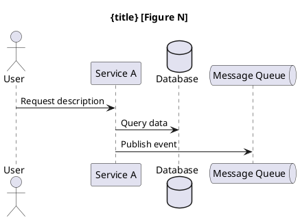

# Phase B — Per-ADR Agent-Native Generation

## Context Contract

- **Inputs:** ADR_INDEX (decisions list, technology_eval from Phase A); ADR_CONTEXT (bounded_contexts, prd_nfr_ids, prd_assumptions, prd_risks, epic_priorities)
- **Outputs:** One file per ADR at `{adrs_path}/adrs/adr-{NNN}-{slug}.md`
- **Carries Forward:** ADR_INDEX.completed_adrs updated per ADR (metadata only, not full text)
- **Flush After:** Each ADR's full text — drop immediately after writing. Only ADR_INDEX survives.
- **Dependency:** Phase A must be COMPLETE (technology_eval populated in ADR_INDEX)
- **H1 Title:** `# {project_name} — {ADR_ID}: {title}`

## Mode-Specific Behavior

- **BUILD:** Generate all ADRs from scratch using the structured template below.
- **REPAIR:** Check if REPAIR_DIRECTIVES target this ADR. If yes: load existing file from SAME path, apply directive, preserve unchanged sections verbatim, rewrite in place. If no: SKIP this ADR entirely.
- **RESUME:** Skip ADRs already in ADR_INDEX.completed_adrs (loaded from _checkpoint.json).

---

## Agent-Native ADR Template

Each ADR file uses structured fields — tables and key-value pairs — not prose paragraphs.
Downstream agents (`establishing-architecture-foundation`, `specifying-architecture`,
`researching-code-design`) read fields programmatically. Prose requires NLP parsing and
introduces ambiguity in field boundaries. If you are writing a sentence where a table row
would convey the same information, use the table.

### YAML Frontmatter (mandatory)

```yaml
---
adr: ADR-{NNN}
title: "{decision title}"
status: Proposed
date: {ISO_DATE}
category: {category from ADR_DECISIONS}
scope: {global | per-context}
affected_contexts: [{BC-XX list}]
related_adrs: [{ADR-NNN list}]
technology_subject: "{the specific technology this ADR decides on}"
---
```

`technology_subject` is the scoping tag for technology neutrality: this technology name
is allowed in this ADR's decision/alternatives/compliance sections. All other technology
names must use capability language.

### Section: context

```markdown
## context

### forces
| id | description | source | impact_on_decision |
|----|-------------|--------|--------------------|
| {NFR-XX / FR-XX / ED-XX} | {one-line} | {PRD / domain-boundaries / context-pack} | {how this constrains the decision} |

### constraints
| id | source | description |
|----|--------|-------------|
| {id or label} | {PRD / context-pack / platform} | {one-line constraint} |

### assumptions_referenced
| id | source | description | confidence |
|----|--------|-------------|------------|
| {ASM-XX} | PRD | {from ADR_CONTEXT.prd_assumptions} | {high / medium / low} |

### risks_referenced
| id | source | description | mitigation_in_this_adr |
|----|--------|-------------|-----------------------|
| {RSK-XX} | PRD | {from ADR_CONTEXT.prd_risks} | {how addressed or "acknowledged — no direct mitigation"} |
```

**Rules:**
- Every force MUST have an `id` from upstream (NFR-XX, FR-XX, ED-XX). No anonymous forces.
- Every assumption and risk MUST trace to ASM-XX / RSK-XX from the PRD.
- `impact_on_decision` is a single clause — not a paragraph.
- Technology names in forces/constraints: capability language ONLY, unless this ADR IS about that technology.

### Section: decision

```markdown
## decision
chosen: "{one-line — the technology or pattern selected}"
rationale: "{one-line technical justification linking to forces above}"

### technology_assignments
| bc | technology | standard | rationale |
|----|-----------|----------|-----------|
| {BC-XX} | {name} | {API / protocol / standard} | {why this BC uses this} |

### prohibited
| item | rationale |
|------|-----------|
| {technology / pattern / practice} | {why prohibited in this decision's scope} |
```

**Rules:**
- `chosen` is ONE line. Details go in `technology_assignments` table.
- Technology names ARE allowed in this section — this IS the decision.
- `prohibited` table only when the decision explicitly excludes alternatives.
- `rationale` references force IDs from the context section (e.g., "NFR-02 eliminates options > 100KB").

### Section: alternatives

```markdown
## alternatives
| id | name | pros | cons | cost | rejection_rationale |
|----|------|------|------|------|---------------------|
| ALT-1 | {option} | {advantages} | {disadvantages} | {Low/Med/High} | {why rejected — one line} |
| ALT-2 | {option} | {advantages} | {disadvantages} | {Low/Med/High} | {why rejected — one line} |
```

**Rules:**
- Minimum 2 alternatives, maximum 4.
- Cost = licensing + infrastructure + training (Low / Med / High summary).
- Technology names ARE allowed (comparing options).
- Each cell is one line. No multi-sentence cells.

### Section: consequences

```markdown
## consequences

### positive
| outcome | nfr_ref | evidence |
|---------|---------|----------|
| {what improves} | {NFR-XX or "—"} | {measurable claim or working-code reference} |

### negative
| trade_off | severity | mitigation |
|-----------|----------|------------|
| {what degrades} | {low / medium / high} | {how addressed, or "accepted"} |

### cost_impact
| cost_type | level | rationale |
|-----------|-------|-----------|
| Development | {Low/Med/High/Zero} | {one-line} |
| Infrastructure | {Low/Med/High/Zero} | {one-line} |
| Licensing | {Low/Med/High/Zero} | {one-line} |
| Training | {Low/Med/High/Zero} | {one-line} |

### quality_impact
| attribute | impact | notes |
|-----------|--------|-------|
| Performance | {positive / negative / neutral} | {one-line} |
| Scalability | {positive / negative / neutral} | {one-line} |
| Reliability | {positive / negative / neutral} | {one-line} |
| Security | {positive / negative / neutral} | {one-line} |
| Maintainability | {positive / negative / neutral} | {one-line} |

### complexity_and_risk
score: {Low | Medium | High}

| risk_type | description | likelihood | impact |
|-----------|-------------|------------|--------|
| {Technical / Organizational / Financial} | {one-line} | {low/med/high} | {low/med/high} |

### trigger_conditions
| condition | consequence |
|-----------|-------------|
| {specific measurable condition that would invalidate this decision} | {revisit / supersede / extend} |
```

### Section: compliance

```markdown
## compliance
| constraint | source | impact_on_decision |
|-----------|--------|-------------------|
| {governance rule} | {context-pack / org-policy} | {how it influenced the decision} |

status: "{applied}" | "No organizational constraints provided; based on technical merit."
```

### Section: diagrams (when architecturally impactful)

Not every ADR needs a diagram. Include only when the decision has spatial/structural
implications that a table cannot convey (deployment topology, communication flows,
security zones, service boundaries).

```markdown
## diagrams

### {diagram_label}
type: {C4_Context | C4_Container | C4_Component | C4_Deployment | Sequence | Security}
title: "{ADR title} — {Diagram Type} [Figure N]"
```

#### Diagram Type Selection

| ADR Category | Diagram Type | PlantUML Style |
|-------------|-------------|----------------|
| Deployment & Infrastructure | C4 Deployment | C4_Deployment.puml include |
| Service Decomposition | C4 Component | C4_Component.puml include |
| Communication Patterns | Sequence | PLAIN PlantUML — NO C4 include |
| Security Architecture | Security zones | PLAIN PlantUML — NO C4 include |
| System-level decisions | C4 Context | C4_Context.puml include |

#### PlantUML Strict Rules

These are domain rules for this skill — not technology prescriptions. PlantUML is the
standard diagramming notation in the ADR pipeline.

1. C4 macros: ONLY `Person()`, `System()`, `System_Ext()`, `Container()`, `ContainerDb()`, `Component()`, `Rel()`, `System_Boundary()`, `Container_Boundary()`, `Deployment_Node()`. No `$tags`, `$sprite`, `$link`, or keyword parameters.
2. `Container_Boundary()` for nesting. NEVER `Container()` with curly braces.
3. `ContainerDb()` ONLY for databases/data stores. `System_Ext()` for external APIs.
4. Every alias in `Rel()` or arrows MUST be declared earlier in the same diagram.
5. Parentheses MUST match on every macro call.
6. Sequence diagrams: PLAIN PlantUML only. No C4 include. Use `actor`, `participant`, `database`, `queue`. Every message label on a SINGLE file line. Use `\n` for visual breaks. Only `\n` escape is valid.
7. Security diagrams: PLAIN PlantUML only. Use `rectangle` for zones.
8. All C4 diagrams: `skinparam backgroundColor white` + `LAYOUT_WITH_LEGEND()`.
9. Colors: Core=#1168bd, Supporting=#6db33f, Generic=#999999, External=#f39c12, DB=#darkblue.
10. **Include line MUST match the deepest element type used in the diagram.** Pick one and use it consistently — each higher-level library transitively includes the lower ones, so picking the deepest is always safe:

    | Deepest element you draw | `{Type}` value | Include line |
    |---|---|---|
    | `Person` / `System` / `System_Ext` only (Context diagram) | `C4_Context` | `!include <C4/C4_Context>` |
    | `Container` / `Container_Boundary` / `ContainerDb` (Container diagram) | `C4_Container` | `!include <C4/C4_Container>` |
    | `Component` inside a `Container_Boundary` (Component / hexagonal-architecture diagram) | `C4_Component` | `!include <C4/C4_Component>` |
    | `Deployment_Node` / `Node` (Deployment diagram) | `C4_Deployment` | `!include <C4/C4_Deployment>` |

    **Common bug to avoid:** `!include <C4/C4_Container>` followed by `Component(...)` calls fails silently — `Component()` is only defined in `C4_Component`. The renderer cannot expand the macro and reports "Failed to load diagram". If the diagram has ANY `Component(...)` line, the include MUST be `<C4/C4_Component>`, not `<C4/C4_Container>`.

#### C4 Template

```plantuml
@startuml
!include <C4/C4_{Type}>
skinparam backgroundColor white
LAYOUT_WITH_LEGEND()
title {title} [Figure N]
' Declare ALL elements before relationships
Rel(source_alias, target_alias, "description", "protocol")
@enduml
```

#### Sequence Template



#### Security Template

```plantuml
@startuml
skinparam backgroundColor white
title {title} [Figure N]
rectangle "External Zone" { actor "User" as user }
rectangle "DMZ" { [API Gateway] as gw }
rectangle "Application Zone" { [Service] as svc #1168bd }
rectangle "Data Zone" { database "Database" as db #darkblue }
user -> gw: HTTPS
gw -> svc: protocol
svc -> db: protocol
@enduml
```

#### Diagram Validation (before writing ADR file)

| # | Check |
|---|-------|
| 1 | @startuml / @enduml present |
| 2 | Correct !include for diagram type (or NO !include for sequence/security) |
| 3 | skinparam backgroundColor white |
| 4 | LAYOUT_WITH_LEGEND() for C4 only |
| 5 | All aliases in Rel()/arrows declared earlier in the diagram |
| 6 | No $tags, $sprite, $link on any macro call |
| 7 | Parentheses match on every macro call |
| 8 | No C4 macros in sequence/security diagrams |
| 9 | Every message label on single file line (sequence) |
| 10 | No backslash sequences other than \n (sequence) |

IF any check fails → fix and re-validate before writing.

### Section: acceptance_criteria (when decision has testable rules)

```markdown
## acceptance_criteria
| scenario | type | given | when | then |
|----------|------|-------|------|------|
| {name} | happy | {precondition} | {action} | {expected outcome} |
| {name} | unhappy | {precondition} | {action} | {expected outcome} |
```

**Rules:**
- Minimum 1 happy + 1 unhappy path (where decision has testable rules).
- Use capability language unless this ADR IS about that technology.
- Each cell is one clause. No multi-sentence Gherkin.

### Section: references

```markdown
## references
| source_id | type | description |
|-----------|------|-------------|
| {FR-XX / NFR-XX / BC-XX / ADR-NNN} | {requirement / constraint / context / related_adr} | {one-line} |
```

---

## Source Fidelity Check (before writing each ADR)

Run these checks AFTER generating, BEFORE writing. This is a pre-write gate.

| # | Check | Action on Failure |
|---|-------|-------------------|
| 1 | Technology names outside decision/alternatives/compliance AND tech is NOT this ADR's `technology_subject` | Remove or replace with capability language |
| 2 | BC-XX references not in ADR_CONTEXT.bounded_contexts | Remove reference or register in open_questions |
| 3 | NFR-XX / FR-XX not in ADR_CONTEXT.prd_nfr_ids / prd_fr_ids | Remove or correct ID format |
| 4 | Fewer than 2 alternatives in the alternatives table | Add from tech eval or industry knowledge (mark [Assumption]) |
| 5 | Cross-refs to ADR-NNN that don't exist in ADR_INDEX.decisions | Remove invalid cross-ref |
| 6 | Prose paragraph where a table row would convey the same data | Convert to structured table row |
| 7 | Missing quality_impact row for any of the 5 ISO 25010 attributes | Add row with "neutral" and reason |

## Post-Section Protocol

Run these in order after EACH ADR. Steps 1, 4, 5 are separate MANDATORY tool calls —
do not batch them across ADRs, do not skip the checkpoint (a crash with no checkpoint
is unrecoverable — see SKILL.md KFM-002/AP-002).

1. **Write** `{adrs_path}/adrs/adr-{NNN}-{slug}.md` — MANDATORY TOOL CALL.
2. **Verify** the file now exists at path and is non-empty. Only after this may this
   ADR be considered done — the tracker flip in step 5 depends on it.
3. **Update** ADR_INDEX.completed_adrs[ADR_ID]: title, category, decision_summary (= `chosen` field), affected_bcs, quality_impact, cross_refs, file, has_diagram, has_gherkin; and cross_ref_map[ADR_ID] with related ADR IDs.
4. **Update** 00-index.md: replace THIS ADR's "⬜ TO BE GENERATED" with "✅ COMPLETE"
   and set its File cell — ONLY now that step 2 verified the file, ONLY this row.
   Never mark a row ✅ before its file exists (SKILL.md KFM-001/AP-001).
5. **Write** _checkpoint.json with current ADR_INDEX state — MANDATORY TOOL CALL every
   iteration; it is the sole durable resume point.
6. **Flush** all ADR text from memory. Only ADR_INDEX survives.
7. **Log:** "ADR-{NNN} complete. Progress: {completed}/{total}."
