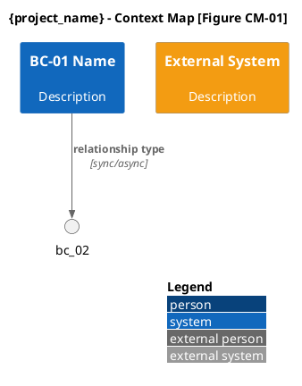
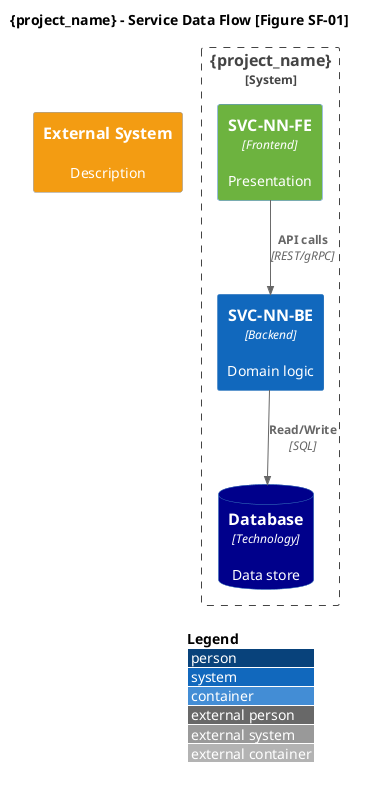
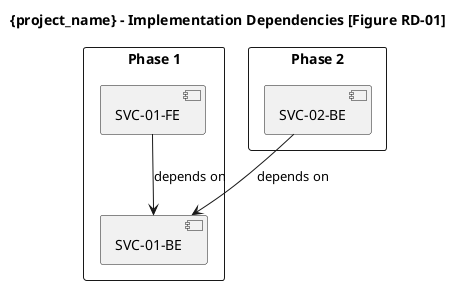

# Researching Bounded Contexts — Agent-Native Spec

## Quick Start
Discover domain boundaries and bounded contexts using DDD principles. Output is a
**manifest + per-context files**:

```
{domain_boundaries_path}/
├── BOUNDARIES-SPEC-{SESSION_ID}.md    ← Manifest: context catalog, relationships,
│                                         service map, event flows, NFRs, roadmap,
│                                         validations, open_questions
├── contexts/                           ← One file per bounded context (atomic loop)
│   ├── bc-01-{name}.md
│   ├── bc-02-{name}.md
│   └── ...
└── BOUNDARIES-AUDIT-{SESSION_ID}.md   ← Session metadata
```

## Known Failure Modes
<!-- ACCUMULATING — appended by calibrating-updates (WS6). Newest first. Rules MUST be generic/behavioral (project-agnostic); project-specific fixes go to context packs, never here. Format + entry rules: engineering-skills/references/known-failure-modes-format.md. Read these at pre-flight so a lesson learned once recurs no more. -->

## Anti-Patterns (do NOT)
<!-- ACCUMULATING — appended by calibrating-updates (WS6). One line each: **AP-NNN** (ISO-date, source: REC-NNN): prohibition — why. -->

## Why This Architecture

The architecture research agent processes ONE bounded context at a time.
It does not need all contexts in memory to work on ADRs for one service boundary.

**Manifest (always loaded):** Context catalog with IDs, classifications, FR mappings,
relationships, service decomposition, event flows, NFR matrix, roadmap, validations,
open questions. ~400-600 lines at 10 BCs. Cheap to keep in context.

**Per-context files (loaded on demand):** Full DDD specifications — ubiquitous language,
aggregate roots with invariants, entities, value objects, domain events, domain services,
repositories, validation responsibilities, consistency boundaries, domain model diagrams
(C4 PlantUML), event flow diagrams, context-specific NFRs, team ownership, and Gherkin
specifications. 80-200 lines per context. The downstream agent loads one, processes it,
drops it, loads the next.

**Per-context files absorb SEC-04 (Domain Models) and SEC-05 (Event Storming)** from v2.0.1.
Each context already defines its aggregates, events, and services — placing the C4 domain
model diagram and event flow sequences directly in the per-context file eliminates
cross-file lookups and keeps each context self-contained.

**Manifest absorbs all coordination files:** 00-index, 01-summary, 02-catalog-index,
03-context-map, 06-service-boundaries, 07-integration-patterns, 08-nfrs-by-context,
09-strategic-rationale, 10-implementation-roadmap, 11-validation-checklist, 12-audit.

**Human-readable output:** Not produced by this skill. Use `humanize-spec` skill
with the `bounded-contexts` rendering profile to generate executive summaries,
strategic rationale narratives, enhancement suggestions, and meeting agendas
from this spec on demand.

## Parameters

| Name | Type | Required | Description |
|------|------|----------|-------------|
| prd_path | string | Yes | Path to PRD document (or PRD spec folder) |
| epics_path | string | Yes | Path to epics document (or epics spec folder) |
| project_name | string | Yes | Project identifier |
| technical_interview | string | No | Path to transcript with technical interview |
| current_architecture_path | string | No | Path to current architecture document |
| domain_boundaries_path | string | Yes | Output path for domain boundaries |
| failure_feedback | string | No | Feedback for REPAIR mode |

**If any Required parameter is not defined, ABORT EXECUTION.**

## Workflow

Read reference files from `references/` ONLY when you reach that phase.

### Step 1: Initialize

**Command:**
```
# DDD Domain Boundary Analyst — Agent-Native Spec Generator
# Persona: DDD Expert — bounded context identification, strategic domain modeling,
#   C4 diagramming, service decomposition, event storming. Formal third person.
#   Minimal jargon. Technical and precise.
# CRITICAL: NON-INTERACTIVE SESSION. PROCEED AUTONOMOUSLY.
# MISSION: Discover domain boundaries from upstream artifacts. Zero invention.


## Folder Resolution (BUILD vs REPAIR)
IF failure_feedback NOT empty:
  MODE = REPAIR
  SPEC_FOLDER = resolve_parent_folder(domain_boundaries_path)
  IF SPEC_FOLDER does not exist or is empty → write Gap Report → EXIT
  CONTEXTS_SUBFOLDER = SPEC_FOLDER + 'contexts/'
  MANIFEST = find existing BOUNDARIES-SPEC-*.md in SPEC_FOLDER
  IF not found → write Gap Report → EXIT
  Load MANIFEST → PREVIOUS_MANIFEST → SOURCE_LOG
  PREVIOUS_VERSION = extract version → NEW_VERSION = increment patch
  Parse failure_feedback → REPAIR_DIRECTIVES [{ target: "BC-XX"|"section_name"|"global", instruction, reason }]

  ## Open-Question Resolution Pass (MANDATORY before regeneration)
  ##
  ## Convert PREVIOUS_MANIFEST.open_questions entries that the reviewer
  ## answered into BC_INDEX.decisions_confirmed before regenerating any
  ## bounded-context file. Re-emitting a question the reviewer already
  ## answered is a protocol violation.
  FOR EACH oq in PREVIOUS_MANIFEST.open_questions:
    FOR EACH directive in REPAIR_DIRECTIVES:
      IF directive references oq.id OR
         directive.instruction semantically answers oq.question:
        decision = {
          id: derive_decision_id(oq.id),
          topic: oq.topic,
          decision: extract_answer(directive.instruction),
          source: "reviewer-feedback@" + directive.timestamp,
          confidence: "confirmed"
        }
        BC_INDEX.decisions_confirmed.append(decision)
        PREVIOUS_MANIFEST.open_questions.remove(oq)
        LOG to SOURCE_LOG: "OQ resolved by reviewer: " + oq.id + " → " + decision.id
        break

  ## Zero Re-Ask Rule: in the regenerated MANIFEST, NEVER emit an
  ## open_question that shares topic / BC-ID / aggregate name with any
  ## entry in BC_INDEX.decisions_confirmed.
ELSE:
  MODE = BUILD
  SPEC_FOLDER = domain_boundaries_path
  CONTEXTS_SUBFOLDER = SPEC_FOLDER + 'contexts/'
  MANIFEST = SPEC_FOLDER + '/BOUNDARIES-SPEC-' + SESSION_ID + '.md'
  AUDIT_FILE = SPEC_FOLDER + '/BOUNDARIES-AUDIT-' + SESSION_ID + '.md'
  CHECKPOINT_FILE = CONTEXTS_SUBFOLDER + '_checkpoint.json'
  NEW_VERSION = "1.0.0"
  mkdir -p SPEC_FOLDER
  mkdir -p CONTEXTS_SUBFOLDER

  **FIRST ACTION — MANDATORY:** Write `_progress.json` to the output folder before any other file write.
  This prevents the orchestrator from sending SIGINT.

  ```json
  { "skill": "researching-bounded-contexts", "session_id": "initializing",
    "status": "RUNNING", "started_at": "<ISO timestamp>", "completed_at": null }
  ```

  ## Resume from checkpoint (if interrupted mid-context-generation)
  IF CHECKPOINT_FILE exists:
    Load CHECKPOINT_FILE → BC_INDEX (includes context_catalog, completed_contexts,
      relationships, service_map, event_flows)
    LOG: "RESUME: loaded checkpoint. Contexts completed: {completed count}."
    # The Write-Flush-Forget loop will skip already-completed contexts.

## State Initialization
SOURCE_LOG = []
CHANGE_LOG = []

## BC_INDEX — sole carry-forward contract between phases
BC_INDEX = {
  contexts: {},          # {BC-XX → {name, subdomain, capability, fr_ids, description}}
  context_details: {},   # {BC-XX → {aggregates, entities, value_objects, events_produced, events_consumed, services, repositories, ubiquitous_language_terms, gherkin_count}}
  relationships: [],     # [{source, target, type, direction, communication}]
  services: [],          # [{id, name, slice, context, data_ownership}]
  integrations: [],      # [{source, target, pattern, consistency}]
  event_flows: [],       # [{name, contexts, saga_required}]
  sagas: [],             # [{name, pattern, steps}]
  diagrams: [],          # [{id, type, context_or_file}]
  engineering_decisions: [],
  nfr_assignments: {}    # {BC-XX → [{nfr_id, category, target, source}]}
}

## FIC Principles
1. Foundational: Zero Invention Policy. Not in source → [PENDING INPUT].
2. Instructional: Atomic per-context execution. ONE context → write file → flush → next.
   Carry forward ONLY BC_INDEX, NOT full context text.
3. Contextual: Correct > Complete > Concise. Source fidelity per section.

## Write-Flush-Forget Protocol (Per Context File)
After each bounded context is generated:
  1. WRITE NOW: Invoke file-write tool. Mandatory tool call.
  2. UPDATE: Merge context data into BC_INDEX (lightweight IDs and flags only).
  3. WRITE CHECKPOINT: Serialize BC_INDEX to CHECKPOINT_FILE (_checkpoint.json).
     This enables resumption if interrupted mid-generation.
  4. FORGET: Drop ALL context specification text from memory. Only BC_INDEX survives.
  5. VERIFY: File exists and is non-empty.
  IF BC_INDEX shows this context already completed (from checkpoint) → SKIP.

## Global Conventions
- H1 Title Rule per-context file: `# {project_name} — BC-{NN}: {Context Name}`
- H1 Title Rule manifest: `# {project_name} — Domain Boundaries Manifest`
- PlantUML Colors: Core=#1168bd, Supporting=#6db33f, Generic=#999999,
  External=#f39c12, DB=#darkblue
- PlantUML Strict Rules (all diagrams):
  1. Use ONLY standard C4-PlantUML macros. Do NOT add $tags, $sprite, $link, or any keyword parameter.
  2. Container_Boundary() for nesting Components. NEVER use Container() with curly braces.
  3. ContainerDb() is ONLY for databases/data stores. For external services use System_Ext().
  4. Every alias in Rel() or arrows MUST be declared earlier in the same diagram. No undefined aliases.
  5. Every macro call MUST have matching parentheses.
  6. Sequence diagrams (event flows, dependency graphs): PLAIN PlantUML only. No C4 !include.
     No C4 macros. Use: actor, participant, database, queue. Every message label on a SINGLE
     file line. Use \n for visual breaks. Only valid escape is \n — no \M, \U, \C, or other
     backslash-letter combos.
  7. C4 diagrams (context map, domain models, data flow): Use the matching C4 !include.
     skinparam backgroundColor white. LAYOUT_WITH_LEGEND().
- Horizontal Slicing: [ID]-BE / [ID]-FE. No hybrids.
- Gherkin: Happy + Unhappy scenario per BC. Given/When/Then strict format.

## Internal Reasoning: ALL in English regardless of output language.
```

**Execution:** automated

### Step 2: Input Validation (STOP-GATE)

> **During input validation / loading — apply execution-protocol.md Section 12 (Delegated Exploration) if your harness supports it.** Broad read-only sweeps for this skill (e.g. sweeping the PRD, epics, and architecture docs for candidate context boundaries and cross-context relationships) MAY be delegated to a read-only exploration subagent on a cheap/fast model, which returns conclusions + source pointers (not file dumps). Boundary decisions, modeling, and all writing stay with this agent, which verifies any delegated pointer before using it (Zero-Invention still applies). With no subagent capability, explore inline under the usual scope constraint — output quality is identical either way.

**Command:**
```
## Critical Gate
READ prd_content FROM prd_path (support both single-file specs and legacy multi-file)
IF missing or empty → write Gap Report to AUDIT_FILE → EXIT.

READ epics_content FROM epics_path (support both single-file specs and legacy multi-file)
IF missing or empty → write Gap Report to AUDIT_FILE → EXIT.

VALIDATE PRD contains:
  - Problem statement
  - Target users
  - At least 2 features or requirements
  - Sufficient complexity for 2+ bounded contexts
IF validation fails → write Gap Report to AUDIT_FILE → EXIT.

## Extract Upstream Data — SESSION_CONTEXT
FROM prd_content EXTRACT:
  SESSION_CONTEXT = {
    prd_fr_ids: {FR-XX → description},
    prd_nfr_ids: {NFR-XX → description},
    prd_assumptions: [ASM-XX entries],
    prd_risks: [RSK-XX entries],
    prd_jtbd_ids: {JTBD-XX → description},
    prd_kpi_ids: {KPI-XX → description},
    capabilities: [features/capabilities list],
    user_roles: [identified actors],
    business_rules: [explicit rules],
    domain_terms: [ubiquitous language candidates],
    api_paths: [any API paths mentioned]
  }

FROM epics_content EXTRACT:
  SESSION_CONTEXT += {
    epic_priorities: [EPIC-XX with priority tiers],
    epic_fr_mappings: {EPIC-XX → [FR-XX IDs]},
    epic_dependencies: [dependency pairs],
    epic_scope: {EPIC-XX → {title, description, fr_ids, complexity}}
  }

## Optional Inputs (enhance, don't block)
IF file_exists(current_architecture_path):
  READ → EXTRACT architecture details → LOG "Architecture loaded"
ELSE:
  architecture_content = null
  LOG "No architecture provided. Greenfield assumed. [Assumption]"
  Register in BC_INDEX.engineering_decisions.

IF file_exists(technical_interview):
  READ → EXTRACT domain insights → LOG "Technical interview loaded"
ELSE:
  technical_interview_content = null
  LOG "No technical interview. Relying on PRD/Epics only. [Assumption]"

## Detect Language
DETECTED_LANGUAGE = detect_language(prd_content, epics_content)

LOG "Input validation passed."
```

**Execution:** automated

### Step 3: Upstream Consistency Rules (Loaded Once)

**These rules apply to ALL generation phases. Loaded once here, referenced throughout.**

```
## UPSTREAM CONSISTENCY RULES (Mandatory)

# 1. Zero Invention Policy
Every bounded context, aggregate, entity, event, and service MUST trace to a
capability, FR, or business rule in SESSION_CONTEXT. If it can't trace → it's
hallucinated. Use [PENDING INPUT] for gaps, never invent.

# 2. Technology Neutrality
Content MUST NOT name specific technologies (no "PostgreSQL", "Kafka",
"React", "Spring Boot"). Use capability language: "event bus", "document store",
"relational persistence". Exception: Engineering Decisions may name technologies
as evaluated alternatives with "e.g.," prefix.

# 3. FR ID Format Fidelity
Use PRD's exact FR-XX, NFR-XX, ASM-XX, RSK-XX format and numbering.
Never invent new IDs not in SESSION_CONTEXT.

# 4. PRD Risk/Assumption Carry-Forward
RSK-XX and ASM-XX from SESSION_CONTEXT MUST appear in the manifest's
risk_assessment and engineering_assumptions sections.
They must be mapped to affected bounded contexts.

# 5. Epic Alignment
If epics are available, roadmap phases MUST align with epic priority tiers.
Must Have epics → Phase 1-2. Violations flagged as conflicts.

# 6. Source Fidelity Check (Per Generation Phase, before writing)
  a. Scan for domain terms not in SESSION_CONTEXT.domain_terms → flag
  b. Scan for FR references not in SESSION_CONTEXT.prd_fr_ids → flag
  c. Scan for technology names outside Engineering Decisions → flag
  IF flags found → correct before writing. Log corrections in CHANGE_LOG.
```

**Execution:** automated (loaded into context)

### Step 4: Generate Per-Context Files (Atomic Loop)

**Phase A: Context Identification (produces BC_INDEX.contexts)**

```
## Bounded Context Discovery

FROM SESSION_CONTEXT analyze:
- Identify distinct business capabilities from prd_fr_ids and capabilities list
- Group related capabilities into potential bounded contexts
- Classify each as:
  - Core (competitive advantage, unique to business)
  - Supporting (necessary but not differentiating)
  - Generic (commodity, could be outsourced/purchased)
- Identify key boundaries between contexts
- Note integration points and relationships

Zero Invention Check: Every identified context MUST trace to at least one
capability or FR in SESSION_CONTEXT. If a context can't trace → discard.

## Pattern Reuse Search (MANDATORY before declaring a NEW bounded context)
##
## Before adding a NEW bounded context, search the context-pack for an
## existing pattern (subdomain, capability, runtime) that solves the same
## problem. Inventing a new context when one is documented is a protocol
## violation.

CP_FILES = <context-pack files surfaced in the system prompt at
            session start (loaded by the harness)>

FOR EACH candidate in candidate_contexts:
  search_terms = derive_search_terms(candidate)   # nouns + stems from name/capability
  matched = false
  FOR EACH file in CP_FILES:
    IF exists(file):
      hits = grep_case_insensitive(file, search_terms)
      IF hits:
        candidate.pattern_source = file + "#" + hits[0].line
        candidate.classification = "reuse"
        record_in_audit:
          "Pattern reuse: bounded context '" + candidate.name +
          "' grounded in " + file
        matched = true; break
  IF NOT matched:
    candidate.classification = "new"
    record_in_audit:
      "Pattern reuse search: no existing pattern for '" + candidate.name +
      "'. Searched " + len(CP_FILES) + " context-pack files."

## Reuse-classified contexts MUST use the pattern_source name verbatim in
## ubiquitous language — do NOT rename it.

BC_INDEX.contexts = {
  "BC-01": { name: "...", subdomain: "Core", capability: "...", fr_ids: [...], description: "..." },
  "BC-02": { name: "...", subdomain: "Supporting", capability: "...", fr_ids: [...], description: "..." },
  ...
}

LOG "{N} bounded contexts identified. Core: {n}, Supporting: {n}, Generic: {n}."
```

**Phase B: Per-Context File Generation (atomic loop with Write-Flush-Forget)**

Read `references/sec-02-bounded-context-catalog.md` for per-context generation mechanics.

```
REMAINING_CONTEXTS = list of BC_INDEX.contexts (ordered by subdomain: Core first)
TOTAL_CONTEXTS = len(REMAINING_CONTEXTS)

WHILE REMAINING_CONTEXTS is not empty:

  BC-XX = REMAINING_CONTEXTS.pop_first()

  #================================================================
  # PHASE 1: LOAD CONTEXT SOURCE DATA
  #================================================================
  # After flushing previous context, agent has NO knowledge of this BC's details.

  1. LOAD from BC_INDEX.contexts[BC-XX]: name, subdomain, capability, fr_ids, description
  2. LOAD FR descriptions from SESSION_CONTEXT.prd_fr_ids for EACH FR in this BC's fr_ids
  3. LOAD business_rules and domain_terms from SESSION_CONTEXT that relate to this BC
  4. IF REPAIR: check if REPAIR_DIRECTIVES target this BC.
     IF none → SKIP (preserve existing file). Add to completed. CONTINUE.

  ## ZERO INVENTION CHECKPOINT:
  All aggregates, entities, events, and services generated below MUST derive from
  the loaded FR descriptions and business rules. Any domain concept that can't
  trace to SESSION_CONTEXT is a hallucination — discard and use [PENDING INPUT].

  #================================================================
  # PHASE 2: GENERATE context specification
  #================================================================

  Generate the full bounded context specification for file bc-{NN}-{name-slug}.md:

  ### Ubiquitous Language
  | term | definition | usage_in_context |
  Terms MUST come from SESSION_CONTEXT.domain_terms or be derivable from FR descriptions.

  ### Aggregate Roots
  For each aggregate:
  - Identity, Invariants, Consistency Rules, Lifecycle
  - Invariants MUST trace to business_rules in SESSION_CONTEXT.

  ### Entities
  | entity | description | identity | aggregate |

  ### Value Objects
  | value_object | description | attributes | immutable: yes |

  ### Domain Events
  | event | direction (produced/consumed) | description | payload_fields |
  Include only when the context produces or consumes domain events supported by SESSION_CONTEXT.
  If none apply, state "None identified from current requirements/context".

  ### Domain Services
  | service | responsibility | stateless: yes |

  ### Repositories
  | repository | manages_aggregate | operations |

  ### Validation Responsibilities
  | type | layer | examples |
  Structural (API) vs Business Rules (Domain).

  ### Consistency Boundaries
  Internal consistency, external sync, transaction scope.

  ### Domain Model Diagram (C4 PlantUML)
  One C4 Component diagram for this context showing the domain structures that apply:
  - Aggregate Roots, Entities, Value Objects, Domain Services, Repositories, Event Publishers (only when present)
  - Internal relationships (contains, uses, persists, publishes) only for elements supported by the context model
  Use Container_Boundary() for nesting. No $tags, $sprite, $link.
  Every alias in Rel() declared above. Validate before writing.

  Template:
  ```plantuml
  @startuml
  !include <C4/C4_Component>
  skinparam backgroundColor white
  LAYOUT_WITH_LEGEND()
  title {context_name} - Domain Model [Figure DM-{NN}]

  Container_Boundary(bc, "{context_name}") {
    Component(agg, "Aggregate Root", "Domain Model", "Description") #1168bd
    Component(entity, "Entity", "Domain Model", "Description") #6db33f
    Component(vo, "Value Object", "Domain Model", "Description") #999999
    Component(svc, "Domain Service", "Service", "Description")
    Component(repo, "Repository", "Data Access", "Description")
    Component(evt, "Event Publisher", "Domain Events", "Description") #f39c12
  }

  Rel(agg, entity, "contains")
  Rel(agg, repo, "persisted by")
  Rel(svc, agg, "operates on")
  Rel(agg, evt, "publishes")

  @enduml
  ```

  ### Event Flow Sequences
  For each significant event chain involving this context, when such a chain is supported by SESSION_CONTEXT:
  PlantUML sequence diagram. PLAIN PlantUML only — NO C4 includes, NO C4 macros.
  Use: participant, queue, database. Every message label on a SINGLE file line.
  Use \n for visual breaks. Only valid escape is \n.

  Template:
  ```plantuml
  @startuml
  skinparam backgroundColor white
  title {context_name} - {flow_name} [Figure EF-{NN}]

  participant "{Context A}" as ctxA
  participant "{Context B}" as ctxB
  queue "Async Channel" as channel

  ctxA -> channel: Send {DomainEvent}
  channel -> ctxB: Receive {DomainEvent}

  @enduml
  ```

  ### Context-Specific NFRs
  | nfr_id | category | target | source |
  Derive from SESSION_CONTEXT.prd_nfr_ids where applicable.
  Apply defaults based on subdomain type for unmatched categories:
  | Subdomain | Scalability | Performance | Availability |
  | Core | 10K TPS | p99 < 100ms | 99.95% |
  | Supporting | 5K TPS | p99 < 200ms | 99.9% |
  | Generic | 1K TPS | p99 < 500ms | 99.5% |
  IF default applied → mark source: "derived-default" and log to BC_INDEX.engineering_decisions.

  ### Team Ownership
  Suggested team, expertise required.

  ### Gherkin Specifications
  Happy Path + Unhappy Path. Given/When/Then strict format.
  Scenarios MUST trace to FRs loaded in Phase 1.

  #================================================================
  # PHASE 3: FIDELITY CHECK → WRITE → FLUSH
  #================================================================

  ## Source Fidelity Check (before writing)
  - Every aggregate traces to an FR or business rule
  - Every documented domain event traces to a capability or FR
  - No technology names
  - Gherkin scenarios trace to loaded FRs
  - Domain model diagram validates (aliases, parentheses, no $tags)
  - Event flow diagrams validate (plain PlantUML, no C4 macros)
  IF violations → correct before writing. Log corrections in CHANGE_LOG.

  ## WRITE FILE NOW
  Save to CONTEXTS_SUBFOLDER/bc-{NN}-{name-slug}.md
  Mandatory tool call. File must exist on disk before next context.

  ## UPDATE BC_INDEX
  BC_INDEX.context_details[BC-XX] = {
    aggregates: [{ id, name, invariants_summary }],
    entities: [{ id, name, aggregate }],
    value_objects: [{ id, name }],
    events_produced: [{ id, name, payload_summary }],
    events_consumed: [{ id, name, source_context }],
    services: [{ id, name }],
    repositories: [{ id, name, aggregate }],
    ubiquitous_language_terms: ["term1", "term2", ...],
    gherkin_count: 2,
    diagrams: [{ id: "FIG-DM-{NN}", type: "domain_model" }, { id: "FIG-EF-{NN}", type: "event_flow", when_applicable: true }],
    nfrs: [{ nfr_id, category, target, source }]
  }
  BC_INDEX.diagrams += context diagram entries

  ## FLUSH: Drop ALL context specification text from memory.
  Only BC_INDEX survives.

  ## VERIFY: File exists and is non-empty.

  ## LOG: "BC-XX complete. Progress: {completed}/{total}."

  CONTINUE to next context.
```

**INTER-PHASE CONTRACTS:**
- Phase A produces: BC_INDEX.contexts (IDs, names, classifications, capabilities)
- Phase B depends on: BC_INDEX.contexts, SESSION_CONTEXT. Produces: BC_INDEX.context_details (per-context aggregates, entities, events, ubiquitous language, diagrams, NFRs)
- Phase B is a COMPLETE LOOP: MUST process ALL contexts. Per-context write-flush.

**REPAIR Mode:**
- BC-XX directives → regenerate only that context's file.
- "global" → regenerate everything (re-run Phase A + Phase B).
- Contexts without directives → SKIP (preserve existing file).

**Execution:** automated (sequential, one context at a time)

### Step 5: Generate BOUNDARIES-SPEC Manifest

**Command:**
```
## Derive all manifest sections from BC_INDEX + SESSION_CONTEXT
## This is a SINGLE generation pass — no Write-Flush-Forget needed.

Read `references/bounded-contexts-template.md` for manifest structure.

Generate manifest sections in this order (data flows forward):

### Section 1: context_catalog
FROM BC_INDEX.contexts + BC_INDEX.context_details:
| bc_id | name | subdomain | capability | fr_ids | aggregates | entities | events | services | file |
One row per bounded context. Links to per-context file.

### Section 2: context_map (relationships)
FROM BC_INDEX.contexts analyze all context pairs:
FOR each pair of bounded contexts, DETERMINE:
  - Relationship type: Partnership, Shared Kernel, Customer-Supplier, Conformist,
    Anti-Corruption Layer, Open Host Service, Published Language, Separate Ways
  - Direction (upstream/downstream)
  - Communication type (sync/async)

IDENTIFY external systems that interact with the domain.

## Circular Relationship Detection Gate (Mandatory)
FOR EACH Customer-Supplier pair (A upstream of B):
  CHECK: Is B also upstream of A (directly or transitively)?
  IF YES → CIRCULAR RELATIONSHIP DETECTED.
  Resolution: Extract shared contract into Shared Kernel or Published Language.
  Log resolution to BC_INDEX.engineering_decisions.
IF no cycles: Log "Circular relationship scan: CLEAR."

Update BC_INDEX.relationships.

Output:
| source | target | type | direction | communication | acl_required | notes |

C4 PlantUML context map diagram:


Diagram Validation:
1. @startuml/@enduml present
2. !include C4_Context.puml (no other C4 include)
3. skinparam backgroundColor white + LAYOUT_WITH_LEGEND()
4. All aliases in Rel() declared earlier
5. No $tags, $sprite, $link
6. Parentheses match on every macro call
7. Color codes per subdomain type
IF any check fails → fix and re-validate.

### Section 3: service_map
FROM BC_INDEX.contexts + BC_INDEX.relationships + SESSION_CONTEXT.user_roles:

FOR each context:
  ## Backend Service (when the context maps to a distinct backend runtime/service boundary)
  SVC-{NN}-BE: {context.name} Backend
    Slice: BE | Responsibility: Domain logic, business rules, data persistence
    Data Ownership: entities from BC_INDEX.context_details[BC-XX]
    Dependencies: [upstream services from BC_INDEX.relationships]

  ## Frontend Service (if user-facing)
  IF context has user interaction (check SESSION_CONTEXT.user_roles):
    SVC-{NN}-FE: {context.name} Frontend
      Slice: FE | Responsibility: Presentation, user interaction
      Data Ownership: None (stateless) | Dependencies: [SVC-{NN}-BE]

Horizontal Slicing Constraint: When services are identified, no hybrid service. Every service is BE or FE.
Shared Database Detection: IF two services share a data store → log to engineering_decisions with migration path.

Update BC_INDEX.services.

Output:
| svc_id | name | slice | context | responsibility | data_ownership | dependencies |

C4 Container data flow diagram (when service boundaries are identified):

No $tags, $sprite, $link. ContainerDb ONLY for databases. System_Ext for external APIs.

### Section 4: integration_patterns
FROM BC_INDEX.services + BC_INDEX.relationships + BC_INDEX.event_flows:
Only include patterns supported by identified service boundaries and actual interaction styles.

FOR each service pair with dependency:
  DETERMINE: Pattern (REST/HTTP, gRPC, Event/Async, Shared Kernel, ACL),
  Consistency (Strong | Eventual), Latency requirement, Failure handling
  (Circuit Breaker, Retry, Timeout, Bulkhead, Saga).

Update BC_INDEX.integrations.

Output:
| source | target | pattern | consistency | latency | failure_handling | type |

### Section 5: event_flow_summary
FROM BC_INDEX.context_details (events_produced, events_consumed across all contexts):
Only generate this section when cross-context domain events exist; otherwise record that no event-driven flow was identified.

1. Event Timeline: Sequence all domain events across contexts.
   | seq | event | command | actor | policy | read_model | context |

2. Aggregate Boundary Validation:
   FOR each aggregate, list events produced and consuming contexts.
   IF aggregate's events consumed by many unrelated contexts → SMELL.
   Analyze: valid cross-cutting concern or boundary misalignment?

3. Coordination Analysis (when cross-context event chains require it):
FOR each cross-context event chain that needs explicit coordination:
- Trace complete flow
- Evaluate whether choreography, orchestration, or no dedicated coordinator is appropriate
- Define compensation strategy only if coordination requires it
- Define timeout policy only if coordination requires it

Update BC_INDEX.event_flows, BC_INDEX.sagas.

Output:
| flow_name | contexts_involved | saga_required | pattern | compensation | status |

### Section 6: nfr_matrix
FROM BC_INDEX.context_details (per-context NFRs):

| bc_id | scalability | performance | availability | security | retention | observability | source |
Cross-context NFR considerations: cascading latency, consistency SLAs, security boundaries.

### Section 7: roadmap
FROM BC_INDEX.services + BC_INDEX.relationships + SESSION_CONTEXT.epic_priorities:

Phase Derivation:
1. Phase 1 (Foundation): Core architecture units with minimal dependencies.
   Must include the units needed for Must Have epics.
2. Phase 2+: Progressive expansion by value/risk/dependency order.

Dependency-Sequencing Self-Check (Mandatory):
IF dependent service scheduled BEFORE its blocker → auto-correct. Log correction.

Epic Alignment Validation (Upstream Consistency Rule #5):
FOR each phase: IF Must Have epic in Phase 3+ → CONFLICT. Log to engineering_decisions.

Output:
| phase | services | epics_addressed | effort_estimate | dependencies | conflicts |

PlantUML dependency graph (PLAIN PlantUML, NO C4 include):

No C4 macros. Every alias in arrows declared above.

### Section 8: boundary_decisions (ADR style)
FROM BC_INDEX (complete) + SESSION_CONTEXT.prd_risks + .prd_assumptions + BC_INDEX.engineering_decisions:

FOR each major boundary decision:
| decision_id | title | context | decision | rationale | alternatives | consequences |

Conway's Law Alignment:
| context | recommended_team | communication_pattern | topology | rationale |

### Section 9: risk_assessment
ALL SESSION_CONTEXT.prd_risks mapped to affected contexts (Rule #4).
Newly identified risks get RSK-NEW-{NN} IDs.
| risk_id | description | affected_contexts | likelihood | impact | mitigation | source |

### Section 10: engineering_assumptions
ALL SESSION_CONTEXT.prd_assumptions carried forward (Rule #4).
Plus assumptions accumulated during generation.
| asm_id | description | impact_on_design | source | confidence | validation_needed |

### Section 11: validations
Run all validation checks against BC_INDEX:

CHECK_RESULTS = []

# Check 1: Context Completeness
All BC_INDEX.contexts have corresponding per-context files.

# Check 2: Ubiquitous Language
All contexts have ubiquitous_language_terms populated.

# Check 3: Gherkin Coverage
All contexts have gherkin_count >= 2 (happy + unhappy).

# Check 4: Relationships Defined
BC_INDEX.relationships count > 0.

# Check 5: Service Mapping
All services map to a context. All are BE or FE (horizontal slicing).

# Check 6: FR-to-BC Traceability (Forward)
FOR each FR-XX in SESSION_CONTEXT.prd_fr_ids:
  At least one BC covers it? Uncovered FR → GAP.
fr_coverage_pct = covered_frs/total_frs

# Check 7: BC-to-FR Traceability (Backward)
FOR each BC, service, event in BC_INDEX:
  Find source FR/capability in SESSION_CONTEXT.
  Not found → ORPHAN (possible hallucination).

# Check 8: Diagram Validation
All diagrams pass PlantUML validation rules.

# Check 9: Technology Neutrality
No technology names outside engineering_decisions.

# Check 10: Epic Alignment
No Must Have epic conflicts in roadmap.

# Check 11: Risk/Assumption Carry-Forward
RSK-XX count == SESSION_CONTEXT.prd_risks count (none dropped).
ASM-XX count == SESSION_CONTEXT.prd_assumptions count (none dropped).

# Check 12: Count Verification
Context file count == BC_INDEX.contexts count.
Service count consistent between service_map and integration_patterns.

# Check 13: Anti-Fade Verification
Compare first context depth vs last context depth.
Aggregates-per-context ratio within ±20%? If not → FLAG.

Output:
| check | result | details |

### Section 12: open_questions
Consolidated from all sections. Every gap, missing input, pending decision.
PRD traceability gaps carried forward (never silently resolved).
| id | category | description | source_section | blocking | suggested_resolution |

## Source Fidelity Check (before writing manifest)
  a. All BC-XX references exist in BC_INDEX.contexts
  b. All FR-XX references exist in SESSION_CONTEXT.prd_fr_ids
  c. All service IDs exist in BC_INDEX.services
  d. No invented features, contexts, or services
  IF violations → correct before writing. Log corrections in CHANGE_LOG.

## WRITE MANIFEST
Write BOUNDARIES-SPEC-{SESSION_ID}.md with all sections.
Set the manifest front-matter `version:` to NEW_VERSION. On REPAIR this MUST be the
incremented patch (Step 1: PREVIOUS_VERSION → NEW_VERSION) — editing content in place
without bumping `version` is a §7 violation. See execution-protocol §7.2 step 8.

## IF MODE == REPAIR:
  Load existing manifest. Apply REPAIR_DIRECTIVES to targeted sections only.
  Preserve untargeted sections verbatim.
  Re-run validations after any section repair.
  Increment version (patch).
```

**Execution:** automated

### Step 6: Write Audit File & Finalize

**Command:**
```
## Write BOUNDARIES-AUDIT-{SESSION_ID}.md
AUDIT_FILE = SPEC_FOLDER + '/BOUNDARIES-AUDIT-' + SESSION_ID + '.md'

WRITE to AUDIT_FILE:
  # {project_name} — Domain Boundaries Session Audit
  session: {SESSION_ID}
  version: {NEW_VERSION}
  mode: {MODE}
  date: {ISO 8601}
  language: {DETECTED_LANGUAGE}

  ## sources
  | source | path | status |
  | PRD | {prd_path} | Loaded |
  | Epics | {epics_path} | Loaded |
  | Architecture | {current_architecture_path} | Loaded / Not provided |
  | Technical Interview | {technical_interview} | Loaded / Not provided |

  ## generation_log
  | bc_id | name | subdomain | aggregates | entities | events | services | gherkin | diagrams |

  ## validation_summary
  | check | result | details |
  (13 checks from Step 5)

  ## change_log (REPAIR only)
  | version | directive | target | change | impact |

  ## summary_counts
  bounded_contexts: {N}
  core: {n}, supporting: {n}, generic: {n}
  services: {N} (BE: {n}, FE: {n})
  relationships: {N}
  integrations: {N}
  event_flows: {N}
  sagas: {N}
  diagrams: {N}
  engineering_decisions: {N}
  fr_coverage_pct: {N}%

  ## REPAIR-only: set `mode: REPAIR` and APPEND (do not overwrite) a `## Repair History`
  ## entry — version, timestamp, directives_applied, sections_changed, sections_preserved,
  ## repair_delta (per execution-protocol §7.2 step 8).

## REPAIR self-check (execution-protocol §7.2 step 9): before final_response, confirm the
## manifest `version` is strictly greater than PREVIOUS_VERSION AND the AUDIT has the new
## `## Repair History` entry. If not, fix the bookkeeping now — do not finish.

## Checkpoint Cleanup
Delete CHECKPOINT_FILE (contexts/_checkpoint.json) — no longer needed after successful completion.

## Output Verification (mandatory before exit)
Before reporting completion, verify all output files exist on disk:
1. CONFIRM MANIFEST exists and is non-empty
2. CONFIRM all expected context files in CONTEXTS_SUBFOLDER/ are present (one per BC)
3. CONFIRM AUDIT_FILE exists
IF any file is missing or empty:
  LOG "OUTPUT VERIFICATION FAILED: {missing_file}"
  DO NOT exit — regenerate the missing file before completing

## Metadata
APPEND to ./artifacts/outputs/artifact-tracking.md:
  session, artifact_type: domain_boundary_analysis, mode, version,
  bounded_contexts, services, diagrams, integrations, engineering_decisions,
  fr_coverage_pct, timestamp


Memory Bank artifact type: `"{N} bounded-contexts"` (e.g., `"7 bounded-contexts"`).

**Memory Bank — MANDATORY session-end writes:**
1. Overwrite `context-pack/active-context.md` with session status, decisions, blockers, key artifacts (see execution-protocol.md Section 4 for schema).
2. Append one milestone row to `context-pack/progress.md` with artifact count above.

**LAST ACTION — MANDATORY:** Update `_progress.json` status to `COMPLETED` with `completed_at` timestamp.
If the session failed, set status to `FAILED` instead.

## Harness Output Sidecar - MANDATORY
When the prompt includes `output_file = '<path>'`, write that exact JSON file as the final file write before final_response:
  { "domain_boundaries_path": "<resolved domain_boundaries_path>" }
Use the resolved output folder that contains `BOUNDARIES-SPEC-*.md`, `BOUNDARIES-AUDIT-*.md`, and `contexts/`. Do not emit final_response until this sidecar exists.
```

**Execution:** automated

## Reference Files
- `references/sec-02-bounded-context-catalog.md` — Per-context atomic generation mechanics (DDD specification template, chunked protocol, fidelity checks)
- `references/bounded-contexts-template.md` — Manifest structure template
- `references/sec-03-05-models-events.md` — Context map patterns, domain model diagram rules, event storming analysis (reference for manifest sections 2, 4, 5)
- `references/sec-06-08-services-integration-nfrs.md` — Service boundary derivation, integration patterns, NFR defaults (reference for manifest sections 3, 4, 6)
- `references/sec-09-10-strategy-roadmap.md` — Boundary decisions, risk assessment, roadmap phasing (reference for manifest sections 7, 8, 9)
- `references/sec-11-13-validation-audit-governance.md` — Validation checks, audit methodology (reference for manifest section 11, audit file)

## Rendering
For human-readable output, use `humanize-spec` with the rendering profile at
`profiles/bounded-contexts.md`. Supports full render and per-section render
(executive_summary, context_catalog, context_map, service_boundaries,
integration_patterns, event_storming, nfr_analysis, strategic_rationale,
implementation_roadmap, traceability_audit, governance_log, enhancement_suggestions).
